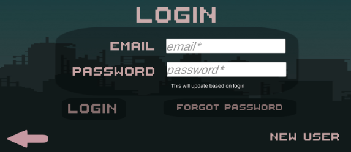
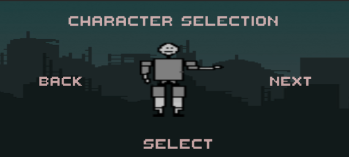

# HangingManny

HangingManny is an engaging and exciting mobile Android 2-D single-player word game where players navigate vertically through bustling environments to collect letters. As the player collects more letters, difficulty increases until they eventually fall or can create a word with accumulated letters. This interactive game will include the following features (subject to change): 
  
## Tools & Frameworks
Unity, C#, Blender, PlasticSCM, Git, Firebase

## Components
*   **Registration:** Upon opening the application, new players will be prompted to create a username and password. The username and password will be saved and authenticated by logging in for returning application usage. 

*   **Profile:** Players can view profile attributes and information, including profile picture, avatar, and personal statistics. From this menu, players can also edit their profile by selecting an attribute to change and modifying it. 

*   **Home Screen:** After login authentication, players will be presented the home screen which contains a menu of options including profile view, leaderboard, shop, settings, and a play button. Layered in the home screen will be music and subtle animations. 

*   **Start Game:** This serves as a way for the user to start the game. Upon clicking “Start Game”,  players will be prompted to select the difficulty level (easy, medium, hard). Subsequently, the player is able to start the game. 

*   **Shop:** As the player enters the In-Game item shop, the player is greeted with all the possible skin combinations for their own character. The player can spend their ingame currency on this virtual marketplace to purchase skins of different styles and colors. 

*   **Settings:** The player is provided with numerous customization options to personalize their gameplay, they can manipulate their game themes, notification, and sound settings. If the player wishes, they can also refer back to the default settings. 

*   **Advertisements:** Advertisements will occupy the free spaces within the screen in the form of image and video popups. Image advertisements will be displayed when the player is AFK or randomly displayed during menu selections. The video advertisements will be displayed when the player loses and will grant the player an extra health point to redo the level they just lost.  

*   **Leaderboard:** The leaderboard will be a culmination of all the statistics the players in the game acquire. The leaderboards will have rankings based on letters collected, levels completed, words formed, and survival time.

## Home Screen

## Login Screen

## Registration Screen

## Profile Screen

## Character Selection Screen

## Game Screen

## Pause Menu

## Game Over Screen

## Running HangingManny

On the USB drive, locate the “HangingManny.apk” file, which is an Android Package file. Download this file to an Android device running an operating system Android 5.0 Lollipop or higher. The application should automatically populate the home screen with an Android widget. Open the app by clicking the icon.

Alternatively, HangingManny can be ran on the Unity editor using the Unity simulator. Download the “HangingManny.apk” Go to unity.com/download and install the Unity version 2021.3.13f1 or higher. Upon entering the Unity Hub, navigate to “Projects” and press “Open”. Select the downloaded .apk file and run the game by clicking the play icon at the top.

